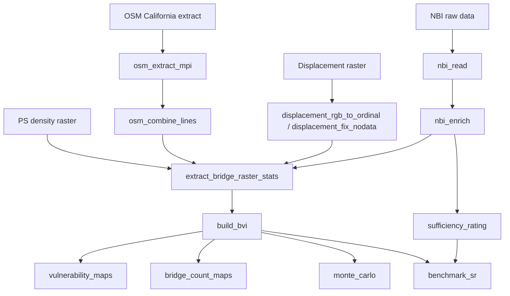

# California Bridge Vulnerability Index (BVI)

PCA/PFA-based Bridge Vulnerability Index for California bridges, integrating NBI inventory data, displacement susceptibility, and spaceborne monitoring availability.

## Pipeline overview



## Repository structure

```
src/bridge_vulnerability/
├── data_prep/          # Steps 1–4: ingest and spatial extraction
├── index/              # Step 5: PCA/PFA index construction
├── plotting/           # Step 6: result maps and sensitivity figures
├── sensitivity/        # Step 7: Monte Carlo / Sobol analysis
├── validation/         # Step 8: comparison with NBI Sufficiency Rating
└── utils/              # Shared helpers (OSM, monitoring class, PCA, plotting)

hpc/                    # Slurm batch scripts for MPI OSM extraction
notebooks/              # Exploratory validation notebooks
config/                 # Path configuration template
```

## Installation

```bash
poetry install
```

Requires Python 3.10.

## Configuration

Scripts currently use absolute paths under `/mnt/e/SOCIAL_PAPER` or `/mnt/g/SOCIAL_PAPER`. Before running, update paths in each script or copy `config/paths.example.yaml` to `config/paths.yaml` and adapt to your environment.

## Running the pipeline

### 1. NBI data preparation

```bash
poetry run python -m bridge_vulnerability.data_prep.nbi_read
poetry run python -m bridge_vulnerability.data_prep.nbi_enrich
```

### 2. OSM bridge lines (HPC)

Submit `hpc/run_osm_line_extraction.sbatch` on your cluster, then combine outputs locally:

```bash
poetry run python -m bridge_vulnerability.data_prep.osm_combine_lines
```

### 3. Displacement raster preparation

```bash
poetry run python -m bridge_vulnerability.data_prep.displacement_rgb_to_ordinal
poetry run python -m bridge_vulnerability.data_prep.displacement_fix_nodata
```

### 4. Bridge-level raster extraction

```bash
poetry run python -m bridge_vulnerability.data_prep.extract_bridge_raster_stats
```

### 5. Build BVI (PCA/PFA)

```bash
poetry run python -m bridge_vulnerability.index.build_bvi
```

### 6. Result maps

```bash
poetry run python -m bridge_vulnerability.plotting.vulnerability_maps
poetry run python -m bridge_vulnerability.plotting.bridge_count_maps
```

### 7. Sensitivity analysis

```bash
poetry run python -m bridge_vulnerability.sensitivity.monte_carlo
```

### 8. Validation against Sufficiency Rating

```bash
poetry run python -m bridge_vulnerability.validation.sufficiency_rating
poetry run python -m bridge_vulnerability.validation.benchmark_sr
```

See also `notebooks/benchmark_poor_bridges.ipynb` for poor-bridge benchmarking.

## External dependencies

PS density maps for California were generated with the separate [PS_predictions](https://github.com/) repository (`predict_PS_dens_for_region_osmnx.py`). A merged California PS-density GeoTIFF is required as input to step 4.

## License

MIT
