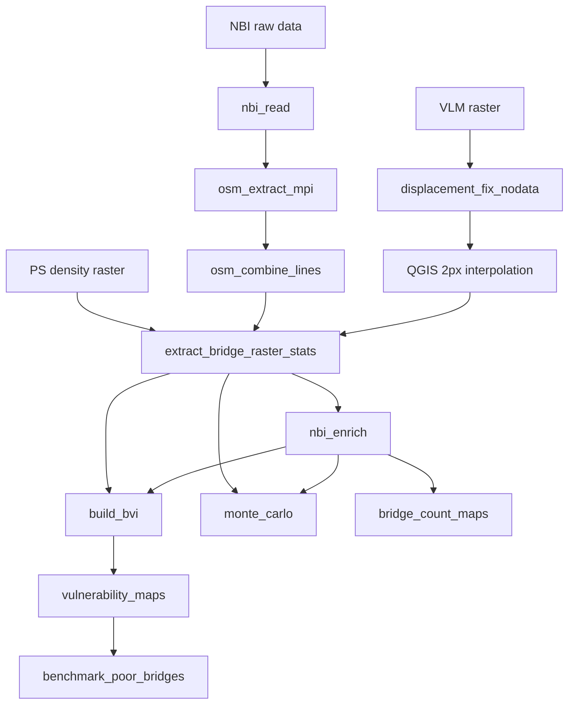

# California Bridge Vulnerability Index (BVI)

PCA/PFA-based Bridge Vulnerability Index for California bridges, integrating NBI inventory data, displacement susceptibility, and spaceborne monitoring availability.

## How to cite

This repository contains code required to reproduce results for the paper entitled "Integrating structural and social vulnerability for equitable bridge maintenance prioritisation" published in International Journal of Disaster Risk Reduction (DOI [https://doi.org/10.1016/j.ijdrr.2026.106115](https://doi.org/10.1016/j.ijdrr.2026.106115)).

See also [`CITATION.cff`](CITATION.cff).

## Data availability

Input data, intermediate files, and pipeline outputs that reproduce the paper are published on Zenodo (external, intermediate, and outputs). Source URLs and licenses for third-party inputs are described in that dataset.

**DOI:** TODO — add Zenodo DOI after dataset publication

Until the DOI is available, configure `data_root` as described below and place the files listed under [Required inputs](#required-inputs).

## Installation

Requires Python 3.10.

**Poetry** (local pipeline — sufficient for most users):

```bash
poetry install
```

**Conda** (same default dependencies, Python 3.10):

```bash
conda env create -f environment.yml
conda activate bridge-vulnerability-california
```

**Optional HPC extras** — only needed to regenerate OSM bridge line shapefiles on a cluster with MPI. With Poetry:

```bash
poetry install --with hpc
```

With conda, additionally install `mpi4py`, `osmnx`, and `utm` (for example from conda-forge). Most users should skip this and use pre-generated OSM line files configured in `config/paths.yaml`.

Optional formatting hooks for contributors:

```bash
poetry install --with dev
pre-commit install
```

## Configuration

File paths are defined in `config/paths.yaml`. Analysis defaults (thresholds, PCA settings, Monte Carlo sample size, plot DPI, and related constants) are defined in `config/params.yaml`. Change values there rather than in scripts.

**Setup (first time):**

```bash
cp config/paths.example.yaml config/paths.yaml
# Edit config/paths.yaml and set data_root to your SOCIAL_PAPER directory
```

**Quick override** (without editing the file):

```bash
export BVI_DATA_ROOT=/mnt/e/SOCIAL_PAPER
```

Dated output folders (`PFA_results_{run_date}`, `plots_{run_date}`, `plots_maps_{run_date}`) use today's date (`DD_MM_YYYY`) automatically. To pin a specific run date:

```bash
export BVI_RUN_DATE=08_01_2026
```

**HPC override** (set in your Slurm script):

```bash
export BVI_DATA_ROOT=/path/to/data_root
```

**Custom config files:**

```bash
export BVI_PATHS_FILE=/path/to/my_paths.yaml
export BVI_PARAMS_FILE=/path/to/my_params.yaml
```

Pipeline scripts also accept the same settings as flags (no file edit needed):

```bash
poetry run python -m bridge_vulnerability.index.build_bvi \
  --data-root /path/to/data_root \
  --run-date 08_01_2026 \
  --log-level INFO
```

Common flags on every step: `--data-root`, `--run-date`, `--paths-file`, `--params-file`, `--log-level`, `--dry-run` (print resolved paths and exit). Monte Carlo additionally accepts `--analysis-type`, `--n-samples`, and `--batch-size`. OSM MPI extraction accepts `--min_range` and `--chunk-size`.

**In Python scripts or notebooks:**

```python
from bridge_vulnerability.config.paths import paths, p

nbi_csv = paths.intermediate.nbi.bridges_enriched_csv
results_dir = paths.outputs.index.pfa_dir
county_shp = p("external", "auxiliary", "counties_shp")
```

Paths are grouped by role in `config/paths.yaml`:

| Section | Meaning |
|---|---|
| `external` | Third-party or manual data — must exist before running the pipeline |
| `intermediate` | Files produced by one step and consumed by later steps |
| `outputs` | Final tables, figures, and analysis directories |

## Required inputs

Before running the pipeline, set `data_root` in `config/paths.yaml` (or `BVI_DATA_ROOT`) and place the following files under that directory. Paths match `config/paths.example.yaml`.

### External data (download or obtain)

| Path under `data_root` | Used in |
|---|---|
| `California_brdgs/NBI/2024del/CA24.txt` | Step 1 — raw NBI inventory |
| `California_county_codes/county_codes.csv` | Step 6 — county FIPS / names |
| `California_county_GDP_2023/California_GDP_manually_extracted.xlsx` | Steps 6, 11 — county GDP |
| `California_borders/ca_counties/CA_Counties.shp` (+ sidecars) | Steps 8–9 — county boundaries |
| `CDC_Social_Vulnerability_2022/California_county_2022.csv` | Step 8 — CDC SVI |
| `California_subsidence/vertical_displacement_Govorcin_paper/CA_VLM.tif` | Step 4 — displacement raster |
| `merged_california.tif` | Step 5 — PS density (see [External dependencies](#external-dependencies)) |

### Bundled intermediate (skip HPC steps 2–3b)

These are **not** produced by the local pipeline. Use the published data bundle or regenerate on HPC:

| Path under `data_root` | Used in |
|---|---|
| `HPC_output/combined_nbi_lines.shp` (+ sidecars) | Step 5 — displacement zonal stats |
| `HPC_output/nbi_segments_segment_1.shp` … `nbi_segments_segment_5.shp` | Step 5 — PS density zonal stats |

### Displacement susceptibility (manual if not bundled)

Step 5 reads `California_subsidence/vertical_displacement_Govorcin_paper/CA_VLM_fixed_filled2px.tif`. The data bundle includes this file. To recreate: run step 4, apply 2-pixel QGIS interpolation on `CA_VLM_fixed.tif`, and save as `CA_VLM_fixed_filled2px.tif`.

## Run the full pipeline (local)

For a single end-to-end run of all **non-HPC** steps (1, 4–11, including both Monte Carlo analyses), use:

```bash
poetry install
cp config/paths.example.yaml config/paths.yaml   # edit data_root
./run_full_pipeline.sh
```

The script checks required inputs, runs each step in order, and stops with QGIS instructions if the susceptibility raster is missing. Steps 2–3b (MPI OSM extraction and segment division) are skipped — pre-generated OSM shapefiles must already be present.

See the header of [`run_full_pipeline.sh`](run_full_pipeline.sh) for the same input checklist in plain text.

## Running the pipeline

Run every script from the repository root with Poetry:

```bash
poetry run python -m bridge_vulnerability.<package>.<module>
```

After step 1, steps 2–3 and step 4 (displacement) can run in parallel. Step 3b requires step 3. Step 5 requires step 3b outputs (or bundled shapefiles) and the displacement susceptibility raster. Steps 6–11 depend on earlier outputs as noted below.

### NBI inventory

**Step 1. `data_prep.nbi_read`** — Loads raw California NBI text data, filters tunnels and culverts, converts coordinates, and writes bridge tables with geometry.

**Input:** `external.nbi.raw_dir` / `external.nbi.raw_file` (raw NBI text file, e.g. `CA24.txt`). **Output:** `intermediate.nbi.bridges_csv`, `bridges_geo_csv`, and `bridges_shp`.

```bash
poetry run python -m bridge_vulnerability.data_prep.nbi_read
```

### OSM bridge lines — optional (HPC only; can run in parallel with step 4)

Most users should **skip steps 2–3b**. The published data bundle includes OSM bridge shapefiles in `{data_root}/HPC_output/` (paths relative to `data_root` in `config/paths.yaml`). Step 5 reads these files directly:

| File in `HPC_output/` | `paths.yaml` key | Used in |
|---|---|---|
| `combined_nbi_lines.shp` | `intermediate.osm.combined_lines` | Step 5 — displacement zonal stats |
| `nbi_segments_segment_1.shp` … `nbi_segments_segment_5.shp` | `intermediate.osm.segments_pattern` | Step 5 — PS density zonal stats |

**If you are regenerating lines on HPC** (`poetry install --with hpc`), run steps 2–3b below. They write chunked shapefiles, combined layers, and five segment shapefiles under `intermediate.osm.hpc_output_dir`. If your output folder or filenames differ from the defaults above, update the `intermediate.osm.*` keys in `config/paths.yaml`.

**Step 2. `data_prep.osm_extract_mpi`** — Extracts OpenStreetMap road lines for each bridge using MPI on an HPC cluster (submit `hpc/run_osm_line_extraction.sbatch`).

**Input:** `intermediate.nbi.bridges_geo_csv`. **Output:** chunked shapefiles in `intermediate.osm.hpc_output_dir` (`nbi_lines_<start>_<end>.shp`, `nbi_polygons_<start>_<end>.shp`).

```bash
srun python -m bridge_vulnerability.data_prep.osm_extract_mpi --min_range 0
```

**Step 3. `data_prep.osm_combine_lines`** — Merges chunked OSM line and polygon shapefiles from the HPC output folder into combined layers.

**Input:** `intermediate.osm.hpc_output_dir` (`nbi_lines_*.shp`, `nbi_polygons_*.shp` from step 2). **Output:** `intermediate.osm.combined_lines` and `intermediate.osm.combined_polygons` (plus diagnostic plots in the same folder).

```bash
poetry run python -m bridge_vulnerability.data_prep.osm_combine_lines
```

**Step 3b. `data_prep.divide_into_segments`** — Divides each bridge centerline into five along-length segments for PS density zonal statistics.

**Input:** `intermediate.osm.combined_lines`, `intermediate.osm.combined_polygons`. **Output:** `intermediate.osm.centerlines` (`nbi_segments.shp`) and `intermediate.osm.segments_pattern` (`nbi_segments_segment_1.shp` … `_5.shp`).

```bash
poetry run python -m bridge_vulnerability.data_prep.divide_into_segments
```

### Displacement rasters (can run in parallel with steps 2–3)

**Step 4. `data_prep.displacement_fix_nodata`** — Replaces NaN nodata values in the Govorcin VLM displacement raster with a fixed placeholder value (999) for downstream zonal statistics.

**Input:** `external.displacement.vlm_raster` (e.g. `CA_VLM.tif`). **Output:** `intermediate.displacement.fixed_raster` (e.g. `CA_VLM_fixed.tif`).

```bash
poetry run python -m bridge_vulnerability.data_prep.displacement_fix_nodata
```

#### Displacement susceptibility raster (required for step 5)

Step 5 reads **`intermediate.displacement.susceptibility_raster`** (default: `CA_VLM_fixed_filled2px.tif`).

**Provided in the data bundle:** This file is included under `{data_root}/intermediate/...` so most users do not need to recreate it.

**How it was produced:** Step 4 converts missing VLM pixels (NaN) to a fixed nodata value of 999 (`CA_VLM_fixed.tif`). The susceptibility raster adds **2-pixel interpolation in QGIS** to fill remaining gaps so displacement values exist over all bridge locations — including areas where the original VLM data had no coverage due to loss of coherence over water or vegetated areas.

> *From the paper:* “For this work, interpolation was applied to the VLM dataset to fill missing data pixels and ensure coverage over all bridges not covered by the original data due to loss of coherence over water or vegetated areas.”

**To recreate from scratch:** Run step 4, open `CA_VLM_fixed.tif` in QGIS, apply 2-pixel interpolation to fill nodata pixels, and save the result as `CA_VLM_fixed_filled2px.tif` (or update `intermediate.displacement.susceptibility_raster` in `config/paths.yaml`).

### Bridge-level raster extraction

**Step 5. `data_prep.extract_bridge_raster_stats`** — Computes zonal statistics of displacement susceptibility and PS density along bridge lines and writes per-bridge CSV/shapefile outputs.

**Input:** `intermediate.osm.combined_lines`, `intermediate.osm.segments_pattern` (segments 1–5), `intermediate.displacement.susceptibility_raster`, `external.ps_density.raster`. **Output:** `intermediate.bridge_lines.displacement_csv`, `monitoring_csv`, and `combined_csv`.

```bash
poetry run python -m bridge_vulnerability.data_prep.extract_bridge_raster_stats
```

### NBI enrichment

**Step 6. `data_prep.nbi_enrich`** — Joins bridge inventory with county names, county GDP, and keeps only bridges that have OSM line statistics from step 5.

**Input:** `intermediate.nbi.bridges_geo_csv`, `intermediate.bridge_lines.displacement_csv`, `external.auxiliary.county_codes_csv`, `external.auxiliary.county_gdp_xlsx`. **Output:** `intermediate.nbi.bridges_enriched_csv` (e.g. `nbi_bridges_geo_county.csv`).

```bash
poetry run python -m bridge_vulnerability.data_prep.nbi_enrich
```

**Required for steps 7–10:** downstream scripts (`build_bvi`, `bridge_count_maps`, `monte_carlo`) read `intermediate.nbi.bridges_enriched_csv`, which only this step produces.

### Build BVI (PCA/PFA)

**Step 7. `index.build_bvi`** — Merges enriched NBI data with displacement/monitoring stats, aggregates to county level, and runs PCA/PFA to produce vulnerability weights and scaled indicators.

**Input:** `intermediate.nbi.bridges_enriched_csv`, `intermediate.bridge_lines.combined_csv`. **Output:** `outputs.index.pfa_dir` (e.g. `county_level_df.csv`, `final_weights.csv`, `full_county_scaled.csv`) and diagnostic plots in `outputs.index.plots_dir`.

```bash
poetry run python -m bridge_vulnerability.index.build_bvi
```

### Result maps

**Step 8. `plotting.vulnerability_maps`** — Produces county-level vulnerability maps, bivariate plots, and indicator contribution figures from BVI outputs.

**Input:** `outputs.index.pfa_dir` (`county_level_df.csv`, `full_county_scaled.csv`, `final_weights.csv`), `external.auxiliary.counties_shp`, `external.auxiliary.cdc_svi_csv`. **Output:** maps in `outputs.maps.maps_dir` and `outputs.maps.indicator_contributions_csv`.

```bash
poetry run python -m bridge_vulnerability.plotting.vulnerability_maps
```

**Step 9. `plotting.bridge_count_maps`** — Maps the number of bridges per county (only needs enriched NBI from step 6; can run before step 7).

**Input:** `intermediate.nbi.bridges_enriched_csv`, `external.auxiliary.counties_shp`. **Output:** `outputs.maps.maps_dir/Number of Bridges_map.png`.

```bash
poetry run python -m bridge_vulnerability.plotting.bridge_count_maps
```

### Sensitivity analysis

**Step 10. `sensitivity.monte_carlo`** — Runs Monte Carlo / Sobol sensitivity analysis (slow; re-runs the index many times). Each analysis can take up to a few hours. The script supports **two separate analyses**; each run executes only one of them:

| `analysis_type` | What varies | What stays fixed |
|---|---|---|
| `"threshold"` (default) | Bridge-indicator thresholds (`ADT_THRESHOLD`, detour miles, waterway/scour ratings, displacement) | Base PCA settings in `base_pca_params` |
| `"pca"` | PCA/index settings (capping, skew/variance thresholds, aggregation method, Mahalanobis cutoff, dropped indicator) | Default thresholds in `default_thresholds` |

**Run both analyses** to get the full sensitivity picture. Either set `BVI_ANALYSIS_TYPE` or pass `--analysis-type` (no file edit needed):

```bash
# 1) Threshold sensitivity
poetry run python -m bridge_vulnerability.sensitivity.monte_carlo
# or: BVI_ANALYSIS_TYPE=threshold poetry run python -m bridge_vulnerability.sensitivity.monte_carlo

# 2) PCA / index sensitivity
poetry run python -m bridge_vulnerability.sensitivity.monte_carlo --analysis-type pca
```

`run_full_pipeline.sh` runs both automatically.

**Input:** `intermediate.nbi.bridges_enriched_csv` (re-loaded internally), `outputs.index.pfa_dir/weighted_subindicators.csv` from step 8 (reference for plots).

**Output:** `outputs.sensitivity.dir` — files are tagged by `analysis_type`, for example:
- `sensitivity_results_threshold_rankings.csv` / `sensitivity_results_pca_rankings.csv`
- `sobol_indices_threshold_rankings_wide.csv` / `sobol_indices_pca_rankings_wide.csv`
- Matching diagnostic figures (uncertainty, Sobol indices, variance decomposition)

### Validation

**Step 11. `validation.benchmark_poor_bridges`** — Compares county BVI rank with poor-bridge replacement-cost rank (requires step 8 for `bivariate_bins.csv`).

**Input:** `outputs.index.pfa_dir/bivariate_bins.csv`, `external.auxiliary.county_gdp_xlsx`. **Output:** `outputs.validation.poor_bridges_benchmark_csv`.

```bash
poetry run python -m bridge_vulnerability.validation.benchmark_poor_bridges
```

## Pipeline overview



## Repository structure

```
src/bridge_vulnerability/
├── config/                    # Path configuration loader
├── data_prep/                 # Steps 1–6: ingest and spatial extraction
├── index/                     # Step 7: PCA/PFA index construction
├── plotting/                  # Steps 8–9: result maps
├── sensitivity/               # Step 10: Monte Carlo / Sobol analysis
│   └── helpers/               # Plotting functions used by monte_carlo (not run directly)
├── validation/                # Step 11: poor-bridges benchmark
└── utils/                     # Shared helpers (OSM, monitoring class, PCA, plotting)

config/paths.example.yaml      # Path template (committed)
config/paths.yaml              # Your local paths (gitignored)
config/params.yaml             # Analysis defaults (thresholds, PCA, Monte Carlo)
run_full_pipeline.sh           # End-to-end local pipeline (steps 1, 4–11)
hpc/                           # Slurm batch scripts for MPI OSM extraction
environment.yml                # Conda environment (Python 3.10)
```

### Modules that are not run directly

These are imported by pipeline scripts; do not invoke them with `poetry run python -m ...`:

| Location | Purpose |
|---|---|
| `sensitivity/helpers/monte_carlo_plots.py` | Visualization helpers for `monte_carlo` |
| `data_prep/bridge_divisions.py` | Geometry helpers for `divide_into_segments` |
| `utils/osm_bridge_lines.py` | OSM line/polygon extraction logic for `osm_extract_mpi` (requires `--with hpc`) |
| `utils/monitoring_class.py` | Spaceborne monitoring classification for `extract_bridge_raster_stats` |
| `utils/pca.py` | PCA/PFA utilities for `build_bvi` and `monte_carlo` |
| `utils/plotting.py` | Map styling helpers for `vulnerability_maps` and `bridge_count_maps` |
| `config/paths.py` | Loads `config/paths.yaml` |
| `config/params.py` | Loads `config/params.yaml` |
| `config/cli.py` | Shared command-line flags for pipeline scripts |

## Pipeline I/O reference

| Step | Script | Reads | Writes |
|---|---|---|---|
| 1 | `nbi_read` | `external.nbi.*` | `intermediate.nbi.bridges_csv`, `bridges_geo_csv`, `bridges_shp` |
| 2–3 | `osm_extract_mpi` / `osm_combine_lines` | `intermediate.nbi.bridges_geo_csv`, `intermediate.osm.hpc_output_dir/nbi_lines_*.shp` (step 3) | `intermediate.osm.hpc_output_dir/nbi_lines_*.shp`, `nbi_polygons_*.shp`, `combined_nbi_lines.shp`, `combined_nbi_polygons.shp` |
| 3b | `divide_into_segments` | `intermediate.osm.combined_lines`, `combined_nbi_polygons` | `nbi_segments.shp`, `nbi_segments_segment_*.shp` |
| 4 | `displacement_fix_nodata` | `external.displacement.vlm_raster` | `intermediate.displacement.fixed_raster` |
| — | QGIS 2px interpolation (manual) | `intermediate.displacement.fixed_raster` | `intermediate.displacement.susceptibility_raster` |
| 5 | `extract_bridge_raster_stats` | `external.ps_density.*`, `intermediate.displacement.susceptibility_raster`, `intermediate.osm.*` | `intermediate.bridge_lines.*` |
| 6 | `nbi_enrich` | `external.auxiliary.*`, `intermediate.nbi.bridges_geo_csv`, `intermediate.bridge_lines.displacement_csv` | `intermediate.nbi.bridges_enriched_csv` |
| 7 | `build_bvi` | `intermediate.nbi.bridges_enriched_csv`, `intermediate.bridge_lines.combined_csv` | `outputs.index.pfa_dir/*`, `outputs.index.plots_dir/*` |
| 8 | `vulnerability_maps` | `outputs.index.pfa_dir/*`, `external.auxiliary.*` | `outputs.maps.maps_dir/*` |
| 9 | `bridge_count_maps` | `intermediate.nbi.bridges_enriched_csv`, `external.auxiliary.counties_shp` | `outputs.maps.maps_dir/*` |
| 10 | `monte_carlo` (run twice: `analysis_type` `"threshold"` then `"pca"`) | enriched NBI + `outputs.index.pfa_dir/weighted_subindicators.csv` (from step 8) | `outputs.sensitivity.dir/*` (filenames include `_threshold_` or `_pca_`) |
| 11 | `benchmark_poor_bridges` | `outputs.index.pfa_dir/bivariate_bins.csv`, `external.auxiliary.county_gdp_xlsx` | `outputs.validation.poor_bridges_benchmark_csv` |

## Paper figures

TODO: map paper figures to output files after the Zenodo bundle is published.

| Paper figure | Output file |
|---|---|
| | |

## External dependencies

PS density maps for California were generated with the PS prediction workflow in [SafeStruct/GlobalRiskBridge](https://github.com/SafeStruct/GlobalRiskBridge) (`src/ps_predictions/predict_PS_dens.ipynb`). That notebook currently supports regions within a single 1×1° tile. To recreate the statewide PS prediction raster, generate all tiles separately and merge them (for example in QGIS). The published data bundle includes the merged California PS-density GeoTIFF required as input to step 5 (`merged_california.tif`), so regenerating the PS density map is optional.

## License

MIT
