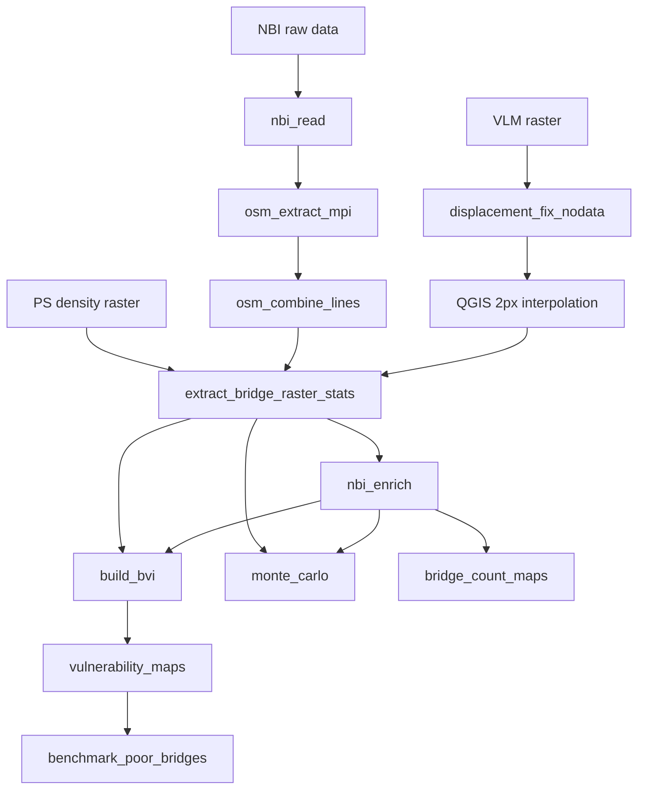

# California Bridge Vulnerability Index (BVI)

PCA/PFA-based Bridge Vulnerability Index for California bridges, integrating NBI inventory data, displacement susceptibility, and spaceborne monitoring availability.

## Installation

Requires Python 3.10.

**Standard install** (local pipeline — sufficient for most users):

```bash
poetry install
```

**Optional HPC install** — only needed to regenerate OSM bridge line shapefiles on a cluster with MPI:

```bash
poetry install --with hpc
```

This adds `mpi4py`, `osmnx`, and `utm`. Most users should skip this and use pre-generated OSM line files configured in `config/paths.yaml`.

## Configuration

All file paths are defined in one place: `config/paths.yaml`.

**Setup (first time):**

```bash
cp config/paths.example.yaml config/paths.yaml
# Edit config/paths.yaml and set data_root to your SOCIAL_PAPER directory
```

**Quick override** (without editing the file):

```bash
export BVI_DATA_ROOT=/mnt/e/SOCIAL_PAPER
```

Dated output folders (`PFA_results_{run_date}`, `plots_{run_date}`, `plots_maps_{run_date}`) use today's date (`DD_MM_YYYY`) automatically. To pin a specific run date:

```bash
export BVI_RUN_DATE=08_01_2026
```

**HPC override** (set in your Slurm script):

```bash
export BVI_DATA_ROOT=/scratch/dmalinowska/SOCIAL_PAPER
```

**Custom config file:**

```bash
export BVI_PATHS_FILE=/path/to/my_paths.yaml
```

**In Python scripts or notebooks:**

```python
from bridge_vulnerability.config.paths import paths, p

nbi_csv = paths.intermediate.nbi.bridges_enriched_csv
results_dir = paths.outputs.index.pfa_dir
county_shp = p("external", "auxiliary", "counties_shp")
```

Paths are grouped by role in `config/paths.yaml`:

| Section | Meaning |
|---|---|
| `external` | Third-party or manual data — must exist before running the pipeline |
| `intermediate` | Files produced by one step and consumed by later steps |
| `outputs` | Final tables, figures, and analysis directories |

## Running the pipeline

Run every script from the repository root with Poetry:

```bash
poetry run python -m bridge_vulnerability.<package>.<module>
```

After step 1, steps 2–4 can run in parallel. Step 5 requires steps 2–4. Steps 6–11 depend on earlier outputs as noted below.

### NBI inventory

**Step 1. `data_prep.nbi_read`** — Loads raw California NBI text data, filters tunnels and culverts, converts coordinates, and writes bridge tables with geometry.

**Input:** `external.nbi.raw_dir` / `external.nbi.raw_file` (raw NBI text file, e.g. `CA24.txt`). **Output:** `intermediate.nbi.bridges_csv`, `bridges_geo_csv`, and `bridges_shp`.

```bash
poetry run python -m bridge_vulnerability.data_prep.nbi_read
```

### OSM bridge lines — optional (HPC only; can run in parallel with step 4)

Most users should **skip steps 2–3**. The published data bundle includes OSM bridge line shapefiles in `{data_root}/intermediate/HPC_output/` (paths relative to `data_root` in `config/paths.yaml`). Step 5 reads these files directly:

| File in `intermediate/HPC_output/` | `paths.yaml` key | Used in |
|---|---|---|
| `combined_nbi_lines.shp` | `intermediate.osm.combined_lines` | Step 5 — displacement zonal stats |
| `nbi_segments_segment_1.shp` … `nbi_segments_segment_5.shp` | `intermediate.osm.segments_pattern` | Step 5 — PS density zonal stats |

**If you are regenerating lines on HPC** (`poetry install --with hpc`), run steps 2–3 below. They write chunked line shapefiles and a combined layer under `intermediate.osm.hpc_output_dir`. If your output folder or filenames differ from the defaults above, update `intermediate.osm.combined_lines`, `intermediate.osm.segments_pattern`, and `intermediate.osm.hpc_output_dir` in `config/paths.yaml`.

**Step 2. `data_prep.osm_extract_mpi`** — Extracts OpenStreetMap road lines for each bridge using MPI on an HPC cluster (submit `hpc/run_osm_line_extraction.sbatch`).

**Input:** `intermediate.nbi.bridges_geo_csv`. **Output:** chunked shapefiles in `intermediate.nbi.lines_dir` (`nbi_lines_<start>_<end>.shp`, `nbi_polygons_<start>_<end>.shp`).

```bash
srun python -m bridge_vulnerability.data_prep.osm_extract_mpi --min_range 0
```

**Step 3. `data_prep.osm_combine_lines`** — Merges chunked OSM line shapefiles from the HPC output folder into a single combined layer.

**Input:** `intermediate.osm.hpc_output_dir` (`nbi_lines_*.shp` from step 2). **Output:** `intermediate.osm.hpc_output_dir/nbi_lines_combined.shp` (plus diagnostic plots in the same folder).

```bash
poetry run python -m bridge_vulnerability.data_prep.osm_combine_lines
```

### Displacement rasters (can run in parallel with steps 2–3)

**Step 4. `data_prep.displacement_fix_nodata`** — Replaces NaN nodata values in the Govorcin VLM displacement raster with a fixed placeholder value (999) for downstream zonal statistics.

**Input:** `external.displacement.vlm_raster` (e.g. `CA_VLM.tif`). **Output:** `intermediate.displacement.fixed_raster` (e.g. `CA_VLM_fixed.tif`).

```bash
poetry run python -m bridge_vulnerability.data_prep.displacement_fix_nodata
```

#### Displacement susceptibility raster (required for step 5)

Step 5 reads **`intermediate.displacement.susceptibility_raster`** (default: `CA_VLM_fixed_filled2px.tif`).

**Provided in the data bundle:** This file is included under `{data_root}/intermediate/...` so most users do not need to recreate it.

**How it was produced:** Step 4 converts missing VLM pixels (NaN) to a fixed nodata value of 999 (`CA_VLM_fixed.tif`). The susceptibility raster adds **2-pixel interpolation in QGIS** to fill remaining gaps so displacement values exist over all bridge locations — including areas where the original VLM data had no coverage due to loss of coherence over water or vegetated areas.

> *From the paper:* “For this work, interpolation was applied to the VLM dataset to fill missing data pixels and ensure coverage over all bridges not covered by the original data due to loss of coherence over water or vegetated areas.”

**To recreate from scratch:** Run step 4, open `CA_VLM_fixed.tif` in QGIS, apply 2-pixel interpolation to fill nodata pixels, and save the result as `CA_VLM_fixed_filled2px.tif` (or update `intermediate.displacement.susceptibility_raster` in `config/paths.yaml`).

### Bridge-level raster extraction

**Step 5. `data_prep.extract_bridge_raster_stats`** — Computes zonal statistics of displacement susceptibility and PS density along bridge lines and writes per-bridge CSV/shapefile outputs.

**Input:** `intermediate.osm.combined_lines`, `intermediate.osm.segments_pattern` (segments 1–5), `intermediate.displacement.susceptibility_raster`, `external.ps_density.raster`. **Output:** `intermediate.bridge_lines.displacement_csv`, `monitoring_csv`, and `combined_csv`.

```bash
poetry run python -m bridge_vulnerability.data_prep.extract_bridge_raster_stats
```

### NBI enrichment

**Step 6. `data_prep.nbi_enrich`** — Joins bridge inventory with county names, county GDP, and keeps only bridges that have OSM line statistics from step 5.

**Input:** `intermediate.nbi.bridges_geo_csv`, `intermediate.bridge_lines.displacement_csv`, `external.auxiliary.county_codes_csv`, `external.auxiliary.county_gdp_xlsx`. **Output:** `intermediate.nbi.bridges_enriched_csv` (e.g. `nbi_bridges_geo_county.csv`).

```bash
poetry run python -m bridge_vulnerability.data_prep.nbi_enrich
```

**Required for steps 7–10:** downstream scripts (`build_bvi`, `bridge_count_maps`, `monte_carlo`) read `intermediate.nbi.bridges_enriched_csv`, which only this step produces.

### Build BVI (PCA/PFA)

**Step 7. `index.build_bvi`** — Merges enriched NBI data with displacement/monitoring stats, aggregates to county level, and runs PCA/PFA to produce vulnerability weights and scaled indicators.

**Input:** `intermediate.nbi.bridges_enriched_csv`, `intermediate.bridge_lines.combined_csv`. **Output:** `outputs.index.pfa_dir` (e.g. `county_level_df.csv`, `final_weights.csv`, `full_county_scaled.csv`) and diagnostic plots in `outputs.index.plots_dir`.

```bash
poetry run python -m bridge_vulnerability.index.build_bvi
```

### Result maps

**Step 8. `plotting.vulnerability_maps`** — Produces county-level vulnerability maps, bivariate plots, and indicator contribution figures from BVI outputs.

**Input:** `outputs.index.pfa_dir` (`county_level_df.csv`, `full_county_scaled.csv`, `final_weights.csv`), `external.auxiliary.counties_shp`, `external.auxiliary.cdc_svi_csv`. **Output:** maps in `outputs.maps.maps_dir` and `outputs.maps.indicator_contributions_csv`.

```bash
poetry run python -m bridge_vulnerability.plotting.vulnerability_maps
```

**Step 9. `plotting.bridge_count_maps`** — Maps the number of bridges per county (only needs enriched NBI from step 6; can run before step 7).

**Input:** `intermediate.nbi.bridges_enriched_csv`, `external.auxiliary.counties_shp`. **Output:** `outputs.maps.maps_dir/Number of Bridges_map.png`.

```bash
poetry run python -m bridge_vulnerability.plotting.bridge_count_maps
```

### Sensitivity analysis

**Step 10. `sensitivity.monte_carlo`** — Runs Monte Carlo / Sobol sensitivity analysis over PCA and threshold parameters (slow; re-runs the index many times).

**Input:** `intermediate.nbi.bridges_enriched_csv` (re-loaded internally), `outputs.index.pfa_dir/weighted_subindicators.csv` from step 8 (reference for plots). **Output:** `outputs.sensitivity.dir` (e.g. `sensitivity_results_threshold_rankings.csv`, Sobol indices CSVs, and diagnostic figures).

```bash
poetry run python -m bridge_vulnerability.sensitivity.monte_carlo
```

### Validation

**Step 11. `validation.benchmark_poor_bridges`** — Compares county BVI rank with poor-bridge replacement-cost rank (requires step 8 for `bivariate_bins.csv`).

**Input:** `outputs.index.pfa_dir/bivariate_bins.csv`, `external.auxiliary.county_gdp_xlsx`. **Output:** `outputs.validation.poor_bridges_benchmark_csv`.

```bash
poetry run python -m bridge_vulnerability.validation.benchmark_poor_bridges
```

## Pipeline overview



## Repository structure

```
src/bridge_vulnerability/
├── config/                    # Path configuration loader
├── data_prep/                 # Steps 1–6: ingest and spatial extraction
├── index/                     # Step 7: PCA/PFA index construction
├── plotting/                  # Steps 8–9: result maps
├── sensitivity/               # Step 10: Monte Carlo / Sobol analysis
│   └── helpers/               # Plotting functions used by monte_carlo (not run directly)
├── validation/                # Step 11: poor-bridges benchmark
└── utils/                     # Shared helpers (OSM, monitoring class, PCA, plotting)

config/paths.example.yaml      # Path template (committed)
config/paths.yaml              # Your local paths (gitignored)
hpc/                           # Slurm batch scripts for MPI OSM extraction
```

### Modules that are not run directly

These are imported by pipeline scripts; do not invoke them with `poetry run python -m ...`:

| Location | Purpose |
|---|---|
| `sensitivity/helpers/monte_carlo_plots.py` | Visualization helpers for `monte_carlo` |
| `utils/osm_bridge_lines.py` | OSM line/polygon extraction logic for `osm_extract_mpi` (requires `--with hpc`) |
| `utils/monitoring_class.py` | Spaceborne monitoring classification for `extract_bridge_raster_stats` |
| `utils/pca.py` | PCA/PFA utilities for `build_bvi` and `monte_carlo` |
| `utils/plotting.py` | Map styling helpers for `vulnerability_maps` and `bridge_count_maps` |
| `config/paths.py` | Loads `config/paths.yaml` |

## Pipeline I/O reference

| Step | Script | Reads | Writes |
|---|---|---|---|
| 1 | `nbi_read` | `external.nbi.*` | `intermediate.nbi.bridges_csv`, `bridges_geo_csv`, `bridges_shp` |
| 2–3 | `osm_extract_mpi` / `osm_combine_lines` | `intermediate.nbi.bridges_geo_csv`, `intermediate.osm.hpc_output_dir/*` | `intermediate.nbi.lines_dir/*`, combined shapefiles |
| 4 | `displacement_fix_nodata` | `external.displacement.vlm_raster` | `intermediate.displacement.fixed_raster` |
| — | QGIS 2px interpolation (manual) | `intermediate.displacement.fixed_raster` | `intermediate.displacement.susceptibility_raster` |
| 5 | `extract_bridge_raster_stats` | `external.ps_density.*`, `intermediate.displacement.susceptibility_raster`, `intermediate.osm.*` | `intermediate.bridge_lines.*` |
| 6 | `nbi_enrich` | `external.auxiliary.*`, `intermediate.nbi.bridges_geo_csv`, `intermediate.bridge_lines.displacement_csv` | `intermediate.nbi.bridges_enriched_csv` |
| 7 | `build_bvi` | `intermediate.nbi.bridges_enriched_csv`, `intermediate.bridge_lines.combined_csv` | `outputs.index.pfa_dir/*`, `outputs.index.plots_dir/*` |
| 8 | `vulnerability_maps` | `outputs.index.pfa_dir/*`, `external.auxiliary.*` | `outputs.maps.maps_dir/*` |
| 9 | `bridge_count_maps` | `intermediate.nbi.bridges_enriched_csv`, `external.auxiliary.counties_shp` | `outputs.maps.maps_dir/*` |
| 10 | `monte_carlo` | enriched NBI + `outputs.index.pfa_dir/weighted_subindicators.csv` (from step 8) | `outputs.sensitivity.dir/*` |
| 11 | `benchmark_poor_bridges` | `outputs.index.pfa_dir/bivariate_bins.csv`, `external.auxiliary.county_gdp_xlsx` | `outputs.validation.poor_bridges_benchmark_csv` |

## External dependencies

PS density maps for California were generated with the separate `PS_predictions` repository (`predict_PS_dens_for_region_osmnx.py`). A merged California PS-density GeoTIFF is required as input to step 5.

## License

MIT
